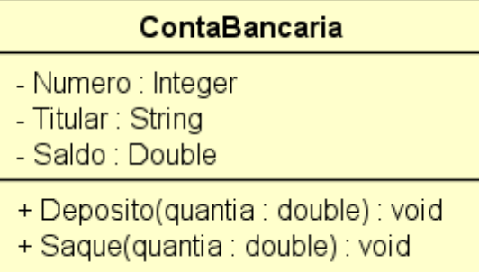

# BancoAspire

## Descrição

Este projeto foi desenvolvido para resolver um desafio proposto no curso **C# COMPLETO Programação Orientada a Objetos** de Nelio Alves. O desafio pertence ao **Capítulo 5: Construtores, palavra this, sobrecarga, encapsulamento**.

- **Link do Curso:** [C# COMPLETO Programação Orientada a Objetos](https://www.udemy.com/course/programacao-orientada-a-objetos-csharp/)
- **Repositório da Resolução Original (Nelio Alves):** [encapsulamento1-csharp](https://github.com/acenelio/encapsulamento1-csharp/)

O objetivo é aplicar conceitos fundamentais de orientação a objetos para simular operações básicas de uma conta bancária.

## Problema Proposto

> Em um banco, para se cadastrar uma conta bancária, é necessário informar o número da conta, o nome do titular da conta, e o valor de depósito inicial que o titular depositou ao abrir a conta. Este valor de depósito inicial, entretanto, é opcional, ou seja: se o titular não tiver dinheiro a depositar no momento de abrir sua conta, o depósito inicial não será feito e o saldo inicial da conta será, naturalmente, zero.
>
> Importante: uma vez que uma conta bancária foi aberta, o número da conta nunca poderá ser alterado. Já o nome do titular pode ser alterado (pois uma pessoa pode mudar de nome por ocasião de casamento, por exemplo).
>
> Por fim, o saldo da conta não pode ser alterado livremente. É preciso haver um mecanismo para proteger isso. O saldo só aumenta por meio de depósitos, e só diminui por meio de saques. Para cada saque realizado, o banco cobra uma taxa de $ 5.00. Nota: a conta pode ficar com saldo negativo se o saldo não for suficiente para realizar o saque e/ou pagar a taxa.
>
> Você deve fazer um programa que realize o cadastro de uma conta, dando opção para que seja ou não informado o valor de depósito inicial. Em seguida, realizar um depósito e depois um saque, sempre mostrando os dados da conta após cada operação.

## Diagrama de Classe

Diagrama da classe `ContaBancaria` que estrutura o projeto.



## Tecnologias Utilizadas

- **.NET 9.0**

## Como Rodar o Projeto

Siga as instruções para clonar e executar o projeto localmente.

1.  **Clone o repositório:**
  ```bash
  git clone https://github.com/seu-usuario/BancoAspire.git
  cd BancoAspire
  ```

2.  **Execute a aplicação:**
  ```bash
  dotnet run
  ```

## Exemplo de Execução

A seguir, um exemplo da interação do usuário com o programa via console.

```console
Entre o número da conta: 8532
Entre o titular da conta: Alex Green
Haverá depósito inicial (s/n)? s
Entre o valor de depósito inicial: 500.00

Dados da conta:
Conta 8532, Titular: Alex Green, Saldo: $ 500.00

Entre um valor para depósito: 200.00
Dados da conta atualizados:
Conta 8532, Titular: Alex Green, Saldo: $ 700.00

Entre um valor para saque: 300.00
Dados da conta atualizados:
Conta 8532, Titular: Alex Green, Saldo: $ 395.00
```

